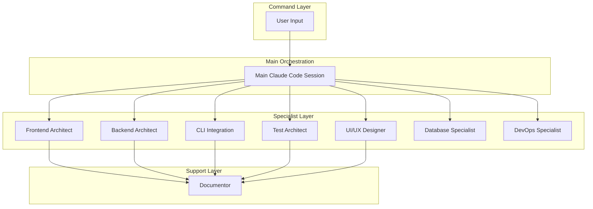
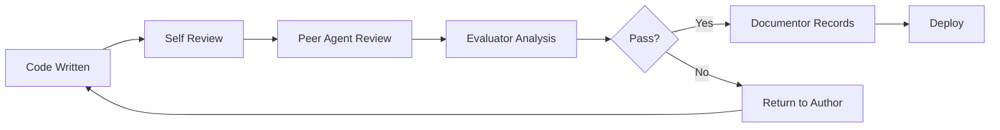

# 🤖 Claude Code IDE Agent System

## 📋 Overview

This directory contains the specialized AI agents that power the Claude Code IDE. Each agent is designed with specific expertise and responsibilities, working together to create a seamless development experience.

## 🎯 Agent Architecture



## 📊 Agent Capabilities Matrix

| Agent | Model | Priority | Primary Focus | Key Technologies |
|-------|-------|----------|---------------|-----------------|
| **frontend-architect** | opus | 9 | UI/UX development | React, TypeScript, Monaco Editor, Playwright |
| **backend-architect** | opus | 9 | Server & API development | Node.js, WebSocket, Express |
| **cli-integration** | opus | 9 | Claude Code CLI interface | Process management, IPC |
| **ui-ux** | opus | 9 | Design & User Experience | Figma, Design Systems, Playwright |
| **test-architect** | sonnet | 8 | Test coverage & quality | Jest, Playwright, RTL |
| **database-specialist** | sonnet | 8 | Database design & optimization | PostgreSQL, Redis, Drizzle ORM |
| **devops-specialist** | sonnet | 8 | Infrastructure & deployment | Docker, CI/CD, Performance |
| **documentor** | sonnet | 7 | Documentation & knowledge | Markdown, TypeDoc, ADRs |

## 🚀 Quick Start

### Basic Usage

```bash
# Direct agent invocation from main Claude session
claude-code --agent frontend-architect --instruction "Create FileExplorer component with virtual scrolling"

# Multi-agent workflow coordinated by main session
claude-code --workflow "full-stack-feature" --agents "frontend-architect,backend-architect"

# Natural language coordination
"I need to implement a new React component. Please delegate to the frontend-architect."
```

### In-IDE Usage

When working in the Claude Code IDE, the main Claude session coordinates agent invocation based on context:

1. **File Creation**: Appropriate architect agent based on file type
2. **Testing**: Test-architect for test file generation
3. **Documentation**: Documentor for README and docs
4. **Design Review**: UI/UX agent with Playwright for visual analysis
5. **Code Quality**: Main session performs evaluator duties with agent assistance

## 🎭 Agent Personalities & Expertise

### 🎯 Main Claude Code Session (Natural Orchestrator)
- **Role**: Strategic coordinator, task decomposer, quality gate enforcer
- **Capabilities**: Project management, agent delegation, evaluation duties
- **Key Features**: Natural language coordination, Serena MCP integration, real-time quality assessment
- **Communication**: Direct delegation to specialized agents based on context

### 🎨 Frontend Architect
- **Personality**: Creative, detail-oriented, user-focused
- **Expertise**: React patterns, TypeScript, performance optimization
- **Key Patterns**: Compound components, custom hooks, virtual scrolling
- **Specialties**: Monaco Editor, state management, accessibility

### ⚙️ Backend Architect
- **Personality**: Systematic, security-conscious, scalable-thinking
- **Expertise**: API design, database optimization, microservices
- **Key Patterns**: Repository pattern, dependency injection, middleware
- **Specialties**: WebSocket, authentication, caching strategies

### 🔧 CLI Integration
- **Personality**: Precise, reliable, process-oriented
- **Expertise**: Process management, IPC, command parsing
- **Key Patterns**: Command queue, response streaming, error recovery
- **Specialties**: Claude Code CLI, file system operations, WebSocket bridge

### 🧪 Testing Specialist
- **Personality**: Thorough, skeptical, quality-obsessed
- **Expertise**: Test strategies, coverage optimization, E2E testing
- **Key Patterns**: Page objects, test fixtures, mocking strategies
- **Specialties**: Jest, Playwright, React Testing Library

### 🗃️ Database Specialist
- **Personality**: Systematic, performance-focused, data-integrity-conscious
- **Expertise**: Database design, query optimization, migration management
- **Key Patterns**: Repository pattern, connection pooling, schema versioning
- **Specialties**: PostgreSQL, Redis, Drizzle ORM, performance tuning

### ⚙️ DevOps Specialist
- **Personality**: Infrastructure-focused, automation-driven, reliability-conscious
- **Expertise**: Container orchestration, CI/CD pipelines, performance optimization
- **Key Patterns**: Infrastructure as code, monitoring, deployment automation
- **Specialties**: Docker, Kubernetes, performance monitoring, site reliability

### 📚 Documentor
- **Personality**: Clear, comprehensive, organized
- **Expertise**: Technical writing, API documentation, knowledge management
- **Key Patterns**: Session continuity, ADRs, visual documentation
- **Specialties**: Markdown, TypeDoc, Mermaid diagrams

### 🎨 UI/UX Designer
- **Personality**: Creative, user-focused, accessibility-conscious
- **Expertise**: Interface design, user experience optimization, visual testing
- **Key Patterns**: Design systems, responsive layouts, interactive prototypes
- **Specialties**: Playwright visual testing, design consistency, user journey optimization

## 💬 Inter-Agent Communication Protocol

### Message Format
```typescript
interface AgentMessage {
  from: 'main-session' | string;  // Main session or agent name
  to: string;                     // Receiving agent
  type: 'delegation' | 'response' | 'status';
  priority: 'low' | 'normal' | 'high' | 'critical';
  payload: {
    task?: Task;
    result?: Result;
    context?: ProjectContext;
    requirements?: Requirements;
  };
  timestamp: Date;
  sessionId: string;
}
```

### Communication Rules
1. **All requests coordinated by Main Claude Session** using natural language
2. **Status updates on task completion** or when requesting assistance
3. **Blocking issues escalated to main session** with context and proposed solutions
4. **Results documented by Documentor** before task closure
5. **Quality assessment performed by main session** with agent input

## 📏 Quality Standards

### Code Quality Requirements
- **Test Coverage**: Minimum 80% (100% for critical paths)
- **TypeScript**: Strict mode, no `any` types
- **Performance**: Response time < 100ms, memory < 500MB
- **Documentation**: All public APIs documented with examples
- **Accessibility**: WCAG 2.1 AA compliance

### Review Process


## 🔄 Workflow Patterns

### Pattern 1: Full Stack Feature
```yaml
workflow: full-stack-feature
coordinator: main-claude-session
steps:
  - main-session: analyze requirements and delegate
  - backend-architect: design and implement API
  - frontend-architect: design and implement UI  
  - ui-ux: visual design and Playwright testing
  - parallel:
    - test-architect: write comprehensive tests
    - database-specialist: optimize data layer
  - documentor: document feature
  - main-session: final quality review and evaluation
```

### Pattern 2: Performance Optimization
```yaml
workflow: performance-optimization
coordinator: main-claude-session
steps:
  - main-session: analyze performance issues using Serena MCP
  - parallel:
    - frontend-architect: optimize client performance
    - backend-architect: optimize server performance
    - database-specialist: optimize database queries
  - test-architect: implement performance tests
  - main-session: evaluate improvements and document results
```

### Pattern 3: Bug Fix
```yaml
workflow: bug-fix
coordinator: main-claude-session
steps:
  - main-session: analyze bug report and identify root cause
  - main-session: delegate to appropriate specialist
  - [specialist]: implement fix with Context7 guidance
  - test-architect: write regression test
  - documentor: update changelog
  - main-session: verify fix quality and completeness
```

## 🚨 Error Handling

### Agent Failure Protocol
1. **Retry with same agent** (max 3 attempts)
2. **Escalate to Orchestrator** for reassignment
3. **Fallback to alternative agent** if available
4. **Human intervention** if all agents fail

### Recovery Strategies
```typescript
const recoveryStrategies = {
  'frontend-architect': ['ui-ux-designer', 'full-stack-developer'],
  'backend-architect': ['full-stack-developer', 'api-specialist'],
  'cli-integration': ['devops-specialist', 'backend-architect'],
  'testing-specialist': ['qa-engineer', 'frontend-architect'],
  'performance-monitor': ['evaluator', 'devops-specialist'],
  'documentor': ['technical-writer', 'frontend-architect'],
  'evaluator': ['performance-monitor', 'testing-specialist']
};
```

## 📈 Performance Targets

| Metric | Target | Critical Threshold |
|--------|--------|-------------------|
| Task Completion Rate | > 95% | < 80% |
| Average Response Time | < 30s | > 60s |
| Error Rate | < 2% | > 5% |
| Documentation Coverage | 100% | < 80% |
| Test Coverage | > 80% | < 60% |
| Code Quality Score | > 90% | < 70% |

## 🔧 Configuration

### Agent Configuration File
```yaml
# .claude/agents/config.yml
agents:
  orchestrator:
    enabled: true
    model: opus
    maxConcurrentTasks: 10
    timeout: 600000
    retryAttempts: 2
    
  frontend-architect:
    enabled: true
    model: opus
    maxConcurrentTasks: 5
    timeout: 300000
    tools:
      - react-devtools
      - monaco-editor
      - webpack-analyzer
    
  performance-monitor:
    enabled: true
    model: sonnet
    scanInterval: 300000  # 5 minutes
    metrics:
      - memory
      - cpu
      - fps
      - bundle-size
```

### Environment Variables
```bash
# .env
CLAUDE_CODE_AGENTS_ENABLED=true
CLAUDE_CODE_ORCHESTRATOR_MODEL=opus
CLAUDE_CODE_MAX_PARALLEL_AGENTS=3
CLAUDE_CODE_AGENT_TIMEOUT=300000
CLAUDE_CODE_AGENT_LOG_LEVEL=info
```

## 🎓 Best Practices

### 1. Task Decomposition
- Break large tasks into < 2-hour chunks
- Define clear acceptance criteria
- Specify dependencies explicitly

### 2. Context Sharing
- Always include relevant file paths
- Provide recent change history
- Share error messages completely

### 3. Performance
- Cache frequently accessed data
- Use streaming for large responses
- Implement progressive enhancement

### 4. Documentation
- Document decisions as they're made
- Include examples in all APIs
- Update docs before closing tasks

## 🔍 Troubleshooting

### Common Issues

| Issue | Cause | Solution |
|-------|-------|----------|
| Agent timeout | Task too complex | Break into smaller tasks |
| High error rate | Missing context | Provide more specific instructions |
| Slow responses | Resource constraints | Increase timeout or optimize query |
| Documentation gaps | Async updates | Enable sync documentation mode |

### Debug Commands
```bash
# Check agent status
claude-code --agent [name] --status

# View agent logs
claude-code --agent [name] --logs --tail 100

# Test agent connectivity
claude-code --agent [name] --health-check

# Reset agent state
claude-code --agent [name] --reset
```

## 📚 Learning Resources

- [Agent Development Guide](./docs/development.md)
- [Custom Agent Creation](./docs/custom-agents.md)
- [Performance Tuning](./docs/performance.md)
- [Integration Patterns](./docs/integration.md)

## 🤝 Contributing

To add or modify agents:

1. Create agent file: `.claude/agents/[agent-name].md`
2. Define capabilities in `src/types/agents.ts`
3. Implement handler in `src/services/agentService.ts`
4. Add tests in `src/__tests__/agents/`
5. Update this README
6. Submit PR with documentation

## 📄 License

Copyright (c) 2024 Claude Code IDE Team. All rights reserved.