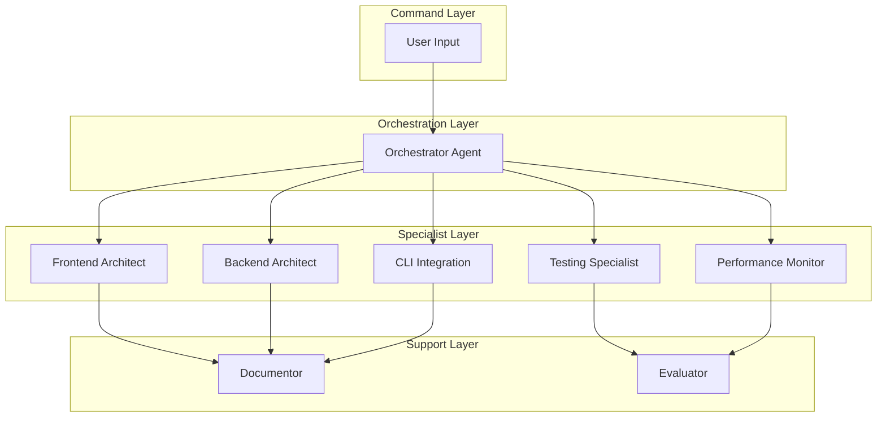
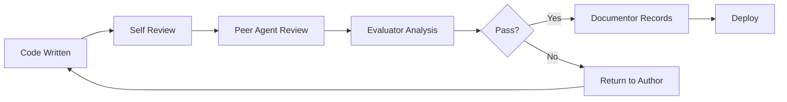

# 🤖 Claude Code IDE Agent System

## 📋 Overview

This directory contains the specialized AI agents that power the Claude Code IDE. Each agent is designed with specific expertise and responsibilities, working together to create a seamless development experience.

## 🎯 Agent Architecture



## 📊 Agent Capabilities Matrix

| Agent | Model | Priority | Primary Focus | Key Technologies |
|-------|-------|----------|---------------|-----------------|
| **orchestrator** | opus | 10 | Task coordination & workflow | Project management, Quality gates |
| **frontend-architect** | opus | 9 | UI/UX development | React, TypeScript, Monaco Editor |
| **backend-architect** | opus | 9 | Server & API development | Node.js, WebSocket, Express |
| **cli-integration** | opus | 9 | Claude Code CLI interface | Process management, IPC |
| **testing-specialist** | sonnet | 8 | Test coverage & quality | Jest, Playwright, RTL |
| **performance-monitor** | sonnet | 7 | Optimization & monitoring | Profiling, Metrics, Analytics |
| **documentor** | sonnet | 8 | Documentation & knowledge | Markdown, TypeDoc, ADRs |
| **evaluator** | sonnet | 7 | Quality & performance analysis | Metrics, Code review, Auditing |

## 🚀 Quick Start

### Basic Usage

```bash
# Initialize an agent for a specific task
claude-code --agent orchestrator --task "Set up new React component"

# Direct agent invocation
claude-code --agent frontend-architect --instruction "Create FileExplorer component with virtual scrolling"

# Multi-agent workflow
claude-code --workflow "full-stack-feature" --agents "orchestrator,frontend-architect,backend-architect"
```

### In-IDE Usage

When working in the Claude Code IDE, agents are automatically invoked based on context:

1. **File Creation**: Appropriate architect agent based on file type
2. **Testing**: Testing specialist for test file generation
3. **Documentation**: Documentor for README and docs
4. **Performance Issues**: Performance monitor for optimization
5. **Code Review**: Evaluator for quality analysis

## 🎭 Agent Personalities & Expertise

### 🎼 Orchestrator
- **Personality**: Strategic, organized, deadline-focused
- **Expertise**: Project management, task decomposition, agent coordination
- **Key Patterns**: Quality gates, dependency management, parallel execution
- **Communication**: Status broadcasts every 15 minutes

### 🎨 Frontend Architect
- **Personality**: Creative, detail-oriented, user-focused
- **Expertise**: React patterns, TypeScript, performance optimization
- **Key Patterns**: Compound components, custom hooks, virtual scrolling
- **Specialties**: Monaco Editor, state management, accessibility

### ⚙️ Backend Architect
- **Personality**: Systematic, security-conscious, scalable-thinking
- **Expertise**: API design, database optimization, microservices
- **Key Patterns**: Repository pattern, dependency injection, middleware
- **Specialties**: WebSocket, authentication, caching strategies

### 🔧 CLI Integration
- **Personality**: Precise, reliable, process-oriented
- **Expertise**: Process management, IPC, command parsing
- **Key Patterns**: Command queue, response streaming, error recovery
- **Specialties**: Claude Code CLI, file system operations, WebSocket bridge

### 🧪 Testing Specialist
- **Personality**: Thorough, skeptical, quality-obsessed
- **Expertise**: Test strategies, coverage optimization, E2E testing
- **Key Patterns**: Page objects, test fixtures, mocking strategies
- **Specialties**: Jest, Playwright, React Testing Library

### 📈 Performance Monitor
- **Personality**: Analytical, proactive, optimization-focused
- **Expertise**: Profiling, metrics collection, bottleneck identification
- **Key Patterns**: Lazy loading, memoization, bundle optimization
- **Specialties**: React DevTools, Lighthouse, bundle analysis

### 📚 Documentor
- **Personality**: Clear, comprehensive, organized
- **Expertise**: Technical writing, API documentation, knowledge management
- **Key Patterns**: Session continuity, ADRs, visual documentation
- **Specialties**: Markdown, TypeDoc, Mermaid diagrams

### 📊 Evaluator
- **Personality**: Critical, data-driven, improvement-focused
- **Expertise**: Code quality, performance analysis, metrics tracking
- **Key Patterns**: Quality gates, trend analysis, recommendation engine
- **Specialties**: SonarQube, ESLint, performance profiling

## 💬 Inter-Agent Communication Protocol

### Message Format
```typescript
interface AgentMessage {
  from: string;         // Sending agent
  to: string;          // Receiving agent
  type: 'request' | 'response' | 'broadcast';
  priority: 'low' | 'normal' | 'high' | 'critical';
  payload: {
    task?: Task;
    result?: Result;
    metrics?: Metrics;
    error?: Error;
  };
  timestamp: Date;
  correlationId: string;
}
```

### Communication Rules
1. **All requests go through Orchestrator** (except emergency escalations)
2. **Status updates every 15 minutes** or on major milestones
3. **Blocking issues escalated immediately** with priority: 'critical'
4. **Results documented by Documentor** before task closure
5. **Performance metrics sent to Evaluator** after each task

## 📏 Quality Standards

### Code Quality Requirements
- **Test Coverage**: Minimum 80% (100% for critical paths)
- **TypeScript**: Strict mode, no `any` types
- **Performance**: Response time < 100ms, memory < 500MB
- **Documentation**: All public APIs documented with examples
- **Accessibility**: WCAG 2.1 AA compliance

### Review Process


## 🔄 Workflow Patterns

### Pattern 1: Full Stack Feature
```yaml
workflow: full-stack-feature
agents:
  - orchestrator: decompose requirements
  - backend-architect: design API
  - frontend-architect: design UI
  - parallel:
    - backend-architect: implement API
    - frontend-architect: implement UI
  - cli-integration: connect systems
  - testing-specialist: write tests
  - performance-monitor: optimize
  - documentor: document feature
  - evaluator: final review
```

### Pattern 2: Performance Optimization
```yaml
workflow: performance-optimization
agents:
  - performance-monitor: profile application
  - evaluator: identify bottlenecks
  - parallel:
    - frontend-architect: optimize client
    - backend-architect: optimize server
  - testing-specialist: performance tests
  - documentor: document improvements
```

### Pattern 3: Bug Fix
```yaml
workflow: bug-fix
agents:
  - evaluator: analyze bug report
  - orchestrator: assign to specialist
  - [specialist]: implement fix
  - testing-specialist: write regression test
  - documentor: update changelog
```

## 🚨 Error Handling

### Agent Failure Protocol
1. **Retry with same agent** (max 3 attempts)
2. **Escalate to Orchestrator** for reassignment
3. **Fallback to alternative agent** if available
4. **Human intervention** if all agents fail

### Recovery Strategies
```typescript
const recoveryStrategies = {
  'frontend-architect': ['ui-ux-designer', 'full-stack-developer'],
  'backend-architect': ['full-stack-developer', 'api-specialist'],
  'cli-integration': ['devops-specialist', 'backend-architect'],
  'testing-specialist': ['qa-engineer', 'frontend-architect'],
  'performance-monitor': ['evaluator', 'devops-specialist'],
  'documentor': ['technical-writer', 'frontend-architect'],
  'evaluator': ['performance-monitor', 'testing-specialist']
};
```

## 📈 Performance Targets

| Metric | Target | Critical Threshold |
|--------|--------|-------------------|
| Task Completion Rate | > 95% | < 80% |
| Average Response Time | < 30s | > 60s |
| Error Rate | < 2% | > 5% |
| Documentation Coverage | 100% | < 80% |
| Test Coverage | > 80% | < 60% |
| Code Quality Score | > 90% | < 70% |

## 🔧 Configuration

### Agent Configuration File
```yaml
# .claude/agents/config.yml
agents:
  orchestrator:
    enabled: true
    model: opus
    maxConcurrentTasks: 10
    timeout: 600000
    retryAttempts: 2
    
  frontend-architect:
    enabled: true
    model: opus
    maxConcurrentTasks: 5
    timeout: 300000
    tools:
      - react-devtools
      - monaco-editor
      - webpack-analyzer
    
  performance-monitor:
    enabled: true
    model: sonnet
    scanInterval: 300000  # 5 minutes
    metrics:
      - memory
      - cpu
      - fps
      - bundle-size
```

### Environment Variables
```bash
# .env
CLAUDE_CODE_AGENTS_ENABLED=true
CLAUDE_CODE_ORCHESTRATOR_MODEL=opus
CLAUDE_CODE_MAX_PARALLEL_AGENTS=3
CLAUDE_CODE_AGENT_TIMEOUT=300000
CLAUDE_CODE_AGENT_LOG_LEVEL=info
```

## 🎓 Best Practices

### 1. Task Decomposition
- Break large tasks into < 2-hour chunks
- Define clear acceptance criteria
- Specify dependencies explicitly

### 2. Context Sharing
- Always include relevant file paths
- Provide recent change history
- Share error messages completely

### 3. Performance
- Cache frequently accessed data
- Use streaming for large responses
- Implement progressive enhancement

### 4. Documentation
- Document decisions as they're made
- Include examples in all APIs
- Update docs before closing tasks

## 🔍 Troubleshooting

### Common Issues

| Issue | Cause | Solution |
|-------|-------|----------|
| Agent timeout | Task too complex | Break into smaller tasks |
| High error rate | Missing context | Provide more specific instructions |
| Slow responses | Resource constraints | Increase timeout or optimize query |
| Documentation gaps | Async updates | Enable sync documentation mode |

### Debug Commands
```bash
# Check agent status
claude-code --agent [name] --status

# View agent logs
claude-code --agent [name] --logs --tail 100

# Test agent connectivity
claude-code --agent [name] --health-check

# Reset agent state
claude-code --agent [name] --reset
```

## 📚 Learning Resources

- [Agent Development Guide](./docs/development.md)
- [Custom Agent Creation](./docs/custom-agents.md)
- [Performance Tuning](./docs/performance.md)
- [Integration Patterns](./docs/integration.md)

## 🤝 Contributing

To add or modify agents:

1. Create agent file: `.claude/agents/[agent-name].md`
2. Define capabilities in `src/types/agents.ts`
3. Implement handler in `src/services/agentService.ts`
4. Add tests in `src/__tests__/agents/`
5. Update this README
6. Submit PR with documentation

## 📄 License

Copyright (c) 2024 Claude Code IDE Team. All rights reserved.